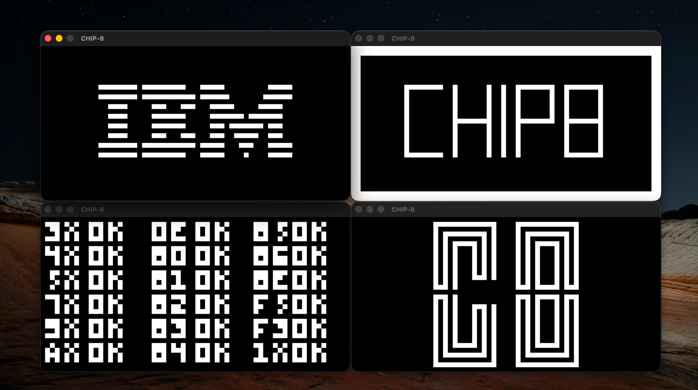

# chip-8
Implementation of a Chip-8 interpreter.


## Table of Contents
- Features
- Screenshots
- Installation
- Usage
- Controls
- Dependencies
- License


## Features
- Full CHIP-8 instruction set
- 4096 bytes of memory
- 64x32 pixel display
- special program and index registers
- 16 general purpose registers
- call stack
- delay and sound timer


## Installation

## Dependencies
- C11 Compiler, Cmake, SDL2
  
### MacOS
` brew install sdl2 cmake `

### Ubuntu
` sudp apt install libsdl2-dev cmake build-essentials `

Copy the following commands into your terminal to install!

```
git clone https://github.com/Isocoram/chip-8
cd chip-8
mkdir build && cd build
cmake .. && make
```


## Usage

The executable takes the path to a ROM as a command line interface argument i.e. run
```
./chip8 roms/<rom_name
```


## Controlls

|Keyboard    |    CHIP-8 |
|------------|-----------|
| 1 2 3 4        |    1 2 3 C   |
| Q W E R        |    4 5 6 D   |
| A S D F        |    7 8 9 E   |
| Y X C V        |    A 0 B F   |


## License

This project is licensed under the **GNU General Public License v3.0** (or later).
